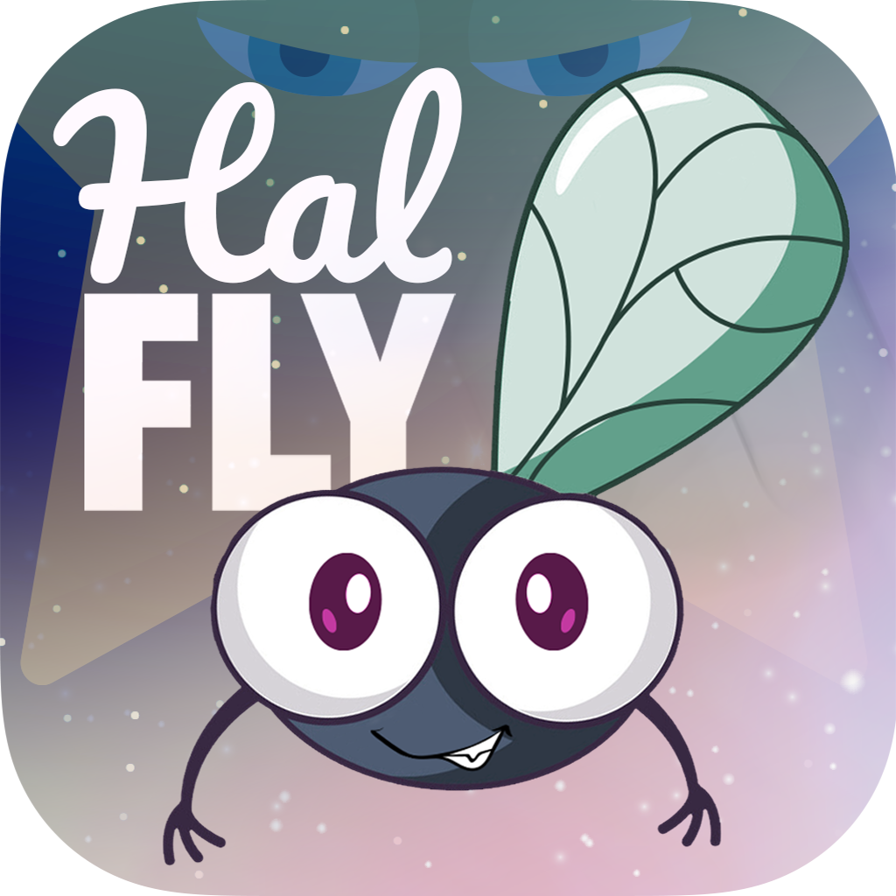

# HalFly Home Page

  

<h1 align="center">HalFly</h1>

  Simple but challenging flying game. Test your reflexes and timing!

---

## 🚀 Description

Take flight and test your skills!

In this minimalist flying game, control your tiny fly through tight spaces and narrow gaps. With simple tap controls and addictive gameplay, every second is a challenge of reflexes and focus.

Whether you're aiming for a high score or just trying to survive a few seconds longer, this game offers quick, intense fun perfect for short play sessions.

- Easy to learn, hard to master  
- Fast-paced arcade action  
- Precision-based flight control  
- Compete for the highest score  

**Do you have what it takes to go to the stars and beyond?**

---

## 🔗 Google Play Store
[https://play.google.com/store/apps/details?id=com.ffn.halfly](#)

---

## 🔐 Privacy Policy

You can find privacy policy at:  
[https://frkaan.github.io/privacy-policy.html](https://frkaan.github.io/privacy-policy.html)

---

## 📬 Contact

This game is developed by **Furkan Akdeniz**.  
For inquiries or support, please reach out via GitHub or the contact information on our Play Store page once published.

